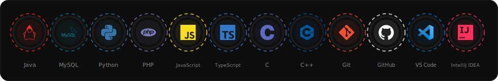
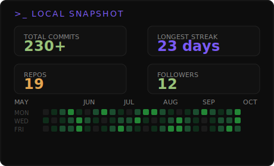

  

  <a href="https://your-portfolio-link.com"><code>PORTFOLIO -&gt;</code></a>
  &nbsp;|&nbsp;
  <a href="https://gitlab.com/your-username"><code>GITLAB -&gt;</code></a>
  &nbsp;|&nbsp;
  <a href="https://linkedin.com/in/your-username"><code>LINKEDIN -&gt;</code></a>

  

## >_ TECH STACK

  

### ABOUT ME
Focused on backend development and building real-world solutions.

I enjoy improving logic, writing cleaner code, and learning through practical systems that connect software and infrastructure.

> `keep learning, keep building...`

### GITHUB STATS

  
  

  

### LANGUAGES

  

---
> "It's not about knowing everything. It's about **getting better** every day." ~/RukamDev `>_`
