  

  

<table width="100%">
  <tr>
    <td width="58%" valign="top">
      <h3><code>root@github:~$ ./profile --scan</code></h3>
      <pre>
&gt; name      : Gabriel S.
&gt; alias     : RukamDev
&gt; role      : Fullstack Developer
&gt; focus     : Backend &#8226; Frontend &#8226; Automation &#8226; Databases
&gt; status    : Building real-world solutions
&gt; mindset   : Clean code, logic and constant evolution

root@github:~$ &#9608;
      </pre>
    </td>
    <td width="42%" valign="top">
      <h3><code>about.me</code></h3>
      <pre>
Software Engineering student building
backend services, automation pipelines
and polished interfaces with a dark,
clean and practical engineering mindset.

current_mode : learn -&gt; build -&gt; refine
mission      : create useful systems
approach     : clarity, logic, evolution
      </pre>
    </td>
  </tr>
</table>

<table width="100%">
  <tr>
    <td width="68%" valign="top">
      <h3><code>tech.stack</code></h3>
      

        
      

    </td>
    <td width="32%" valign="top">
      <h3><code>currently.learning</code></h3>
      

        
      

    </td>
  </tr>
</table>

<table width="100%">
  <tr>
    <td width="100%" valign="top">
      <h3><code>github.stats</code></h3>
      

        
        
      

    </td>
  </tr>
</table>

<table width="100%">
  <tr>
    <td width="100%" valign="top">
      <h3><code>activity.graph</code></h3>
      

        
      

    </td>
  </tr>
</table>

<table width="100%">
  <tr>
    <td width="100%" valign="top">
      <h3><code>contact.links</code></h3>
      

        
        
        
      

    </td>
  </tr>
</table>

  

