<p align="center">
  
</p>

<p align="center">
  <!-- Add LinkedIn URL here later -->
  
  <a href="https://github.com/RukamDev">
    
  </a>
  <!-- Add portfolio URL here later -->
  
</p>

<p align="center">
  <a href="https://github.com/RukamDev">
    
  </a>
  
</p>

<p align="center">
  
</p>

```bash
$ whoami
Name........: Gabriel S.
Username....: RukamDev
Role........: Software Engineering Student
Focus.......: Backend | Frontend | Data Analysis | Automation
Mindset.....: Smart problem-solving, automation and data security
```

## About

- Software Engineering student with a strong background in hardware.
- Focused on backend development, automation and smart problem-solving.
- Enjoy working with frontend projects, data, MySQL and cross-platform environments.
- Interested in data security, system reliability and continuous improvement through technology.

## Tech Stack

<p align="center">
  
</p>

## GitHub Stats

<p>
  
  
</p>

<p>
  
</p>

## Current Focus

- Building practical backend and automation projects for my portfolio.
- Improving my skills in software engineering, Java, Python and databases.
- Exploring data security, reliability and smart solutions for real-world problems.

## Contact

- GitHub: [@RukamDev](https://github.com/RukamDev)

---

<p align="center"><i>"Smart solutions solve problems. Great engineering makes them reliable, secure and built to last."</i></p>
